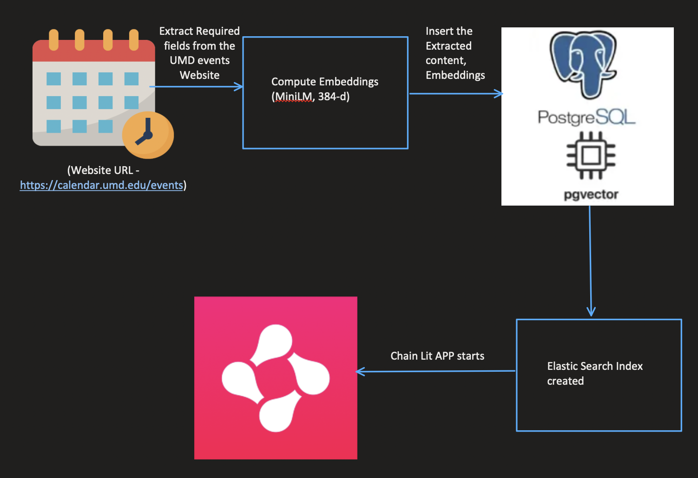
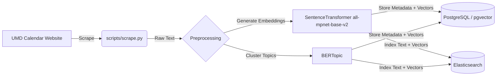
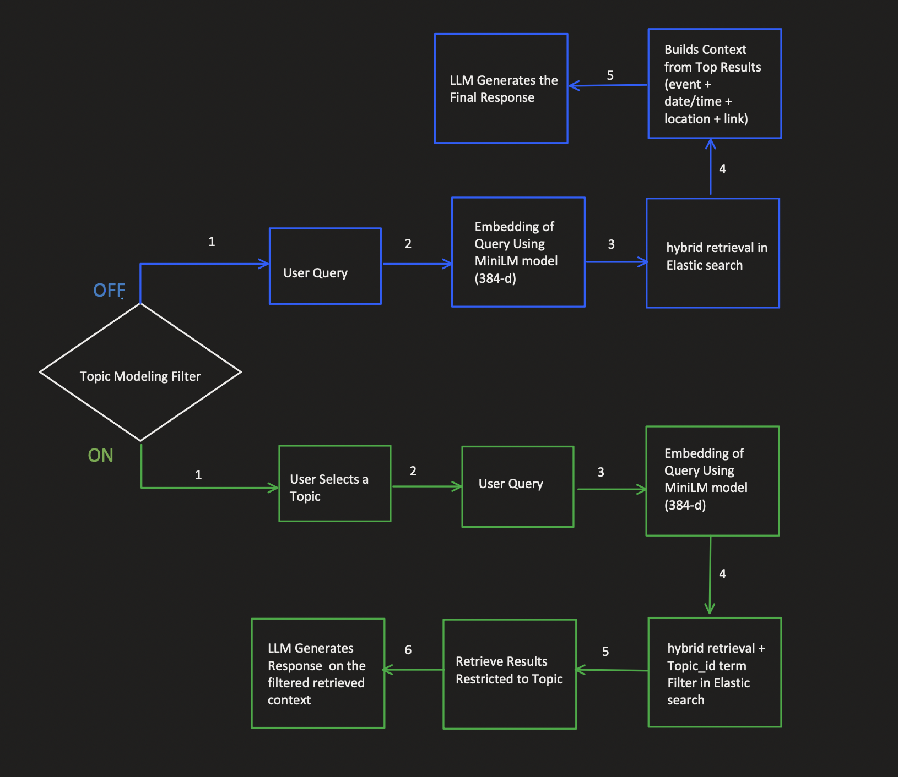
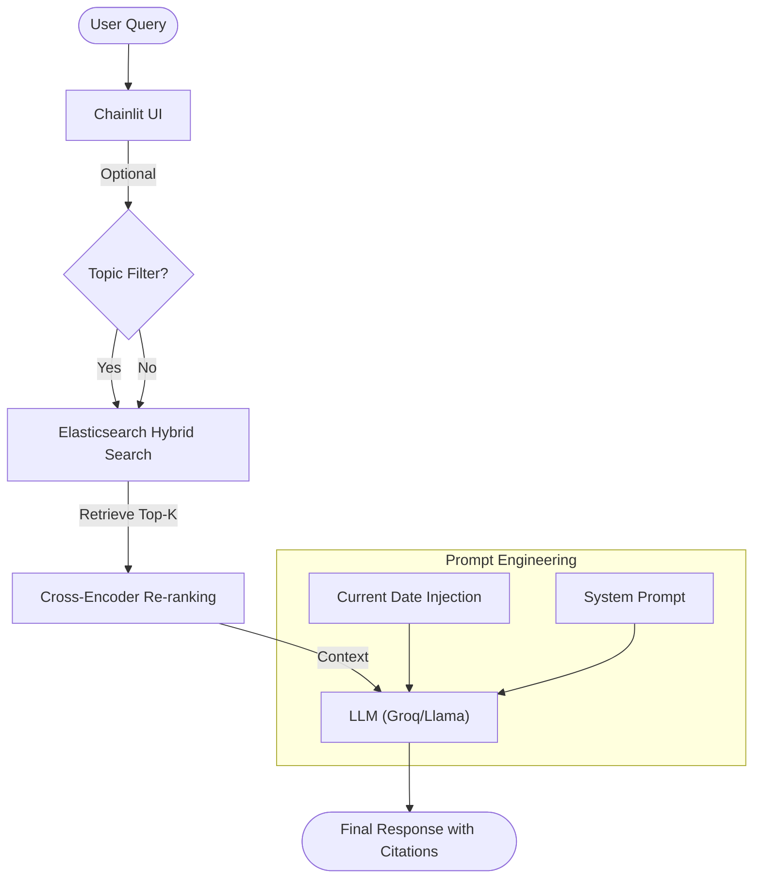

# UMD Events Dialogue System (Testudo Bot)

**Team:** Group-7 (Chanakya Chelamkuri, Manoj Kumar Bashaboina, Vineet Jujjavarapu, Venkata Siva Rajesh Vithanala)

**Course:** DATA641 Natural Language Processing, University of Maryland

**Repository status:** This repository is a personal fork/continuation of the original Group-7 team project.

## 📖 Overview

This repository extends the original Group-7 Testudo Bot project, a conversational question-answering system designed to help users discover University of Maryland (UMD) events using natural language. It solves the problem of information overload in traditional calendar interfaces by integrating **Retrieval-Augmented Generation (RAG)** with **unsupervised topic modeling**.

The system scrapes the official UMD events calendar, indexes events using hybrid retrieval (vector + keyword), and generates grounded responses using a Large Language Model (LLM) to minimize hallucinations.

## 📚 Documentation

- Documentation index: [`docs/README.md`](docs/README.md)
- Changelog: [`docs/CHANGELOG.md`](docs/CHANGELOG.md)
- Roadmap: [`docs/ROADMAP.md`](docs/ROADMAP.md)

## ✨ Key Features

- **Hybrid Retrieval:** Combines **Elasticsearch** keyword search (BM25) with **dense vector search** (all-mpnet-base-v2 embeddings) to capture both exact matches and semantic intent.

- **Grounded RAG:** Generates answers strictly from retrieved event contexts. The system is time-aware, allowing it to interpret relative queries like "events this weekend" or "career fairs tomorrow".

- **Topic Modeling:** Uses **BERTopic** to cluster events into semantic categories (e.g., "Music", "Career") and auto-generates topic labels for UI filtering.

- **Conversational Interface:** Built with **Chainlit**, supporting interactive chat, rich source citations (cards with date/location), and topic selection.

- **Evaluation:** Integrated **RAGAS** metrics (faithfulness, answer relevancy, context precision) to quantitatively assess performance.

## 🏗️ System Architecture

The project follows a microservices architecture orchestrated via Docker Compose:

1. **Data Ingestion (`scripts/scrape.py`)**: Scrapes event data (title, date, time, location, description) from `calendar.umd.edu` over a rolling date range (default: today → 3 months ahead). Supports CLI arguments (`--start-date`, `--end-date`, `--output`, `--use-cloudscraper`), day-by-day pagination, event normalization, retry logic, and an importable `scrape_events()` API.
2. **Storage Layer**:
   - **PostgreSQL (`pgvector`)**: Stores structured event metadata, high-dimensional vector embeddings, and content hashes for deduplication.

   - **Elasticsearch**: Indexes text and vectors for high-performance hybrid search.

3. **Application Logic (`app.py`)**:
   - Connects to the LLM provider via **Groq** (supporting low-latency Llama 3.x models).
   - Handles query processing, retrieval ranking, and response generation.
   - Provides a `/refresh` chat command (and quick-action button) to trigger on-demand ETL from within the UI.

4. **Loader Service (`scripts/loader.py`)**: An initialization service that incrementally upserts event data into PostgreSQL and Elasticsearch using content-hash-based deduplication. New events are inserted, changed events are updated, and stale events are removed. Falls back to the bundled JSON seed file on first-time setup. A `FORCE_CLEAN_SCHEMA=true` env var preserves the legacy truncate-and-reload behavior.

5. **ETL Service (`scripts/etl.py`)**: An on-demand ETL script that orchestrates the full scrape → load pipeline. Computes a date range, calls `scrape_events()`, passes results to `load_data()`, and reports a summary with timing. Can be run via `docker compose run --rm etl` or `python scripts/etl.py --days N`.

### High-Level Design


_Figure 1: Data Pipeline - From scraping the UMD calendar to generating embeddings and storing in Postgres/Elasticsearch._



### Query Workflow


_Figure 2: RAG Inference Flow - How the system processes user queries using hybrid retrieval and topic filtering before generating an LLM response._



## 🚀 Replication Instructions

Follow these steps to replicate and run the system locally.

### Prerequisites

- **Docker** and **Docker Compose** installed on your machine.
- **Git** for cloning the repository.
- An API key from **Groq** (for LLM access).

### Step 1: Clone the Repository

```bash
git clone https://github.com/vineetj5/UMD_Event_DialogSystem.git
cd UMD_Event_DialogSystem

```

### Step 2: Configure Environment Variables

Create a `.env` file in the root directory. You must add your Groq API key (from https://console.groq.com).

```bash
# .env file
GROQ_API_KEY=your_actual_api_key_here

# Optional: Override defaults if needed
# The system supports dual env-var naming for local-vs-Docker flexibility:
#   Docker (set by docker-compose.yaml): POSTGRES_HOST, POSTGRES_PORT, POSTGRES_DB, POSTGRES_USER, POSTGRES_PASSWORD
#   Local (set in .env):                 DB_HOST, DB_PORT, DB_NAME, DB_USER, DB_PASSWORD
# If both are set, POSTGRES_* takes priority. Final default for host is localhost.
DB_NAME=umd_events
DB_USER=umd_user
DB_PASSWORD=umd_password
DB_HOST=localhost
ELASTIC_HOST=http://localhost:9200

```

> **Note:** Inside Docker, `docker-compose.yaml` sets `POSTGRES_HOST=db` and `ELASTIC_HOST=http://elasticsearch:9200` automatically. The `.env` values above are used when running scripts locally (e.g., `python scripts/etl.py`).

### Step 3: Build and Run with Docker

The `docker-compose.yaml` file defines the services for the database, search engine, data loader, and application.

```bash
docker compose up --build

```

**What happens during startup:**

1. **`db` (Postgres)** and **`elasticsearch`** containers start first.
2. **`loader`** service waits for the database and Elasticsearch to be healthy, then incrementally upserts event data into Postgres and Elasticsearch.
   - If `EVENTS_JSON_NAME` is set, loader uses that file.
   - Otherwise, loader auto-selects the most recent `data/umd_events_YYYY-MM-DD.json` snapshot.
   - If no dated snapshot exists, loader falls back to `data/umd_calendar_2025-10-01_to_2025-10-31.json`.
3. **`app`** service starts the Chainlit server once data loading is complete.

## 🔄 Updating Events

On first startup, the loader seeds the database from the bundled JSON file.

To refresh with the latest events from `calendar.umd.edu`, use either option:

- **Option A (Chat):** Type `/refresh` in the chat or click the **🔄 Refresh Events** quick action button.
- **Option B (CLI):** Run:

```bash
docker compose run --rm etl
```

The ETL script scrapes the next 3 months of events, adds new events, updates changed events, removes stale events, and saves a snapshot to `data/umd_events_<date-it-was-scraped>.json`.
No always-running scheduler is required — refresh happens on demand.

### Step 4: Access the Application

Once the containers are running, open your browser and navigate to:

```
http://localhost:8501

```

To stop the application, run:

```bash
docker compose down

```

## 📂 Project Structure

| Path                         | Description                                                                                                             |
| ---------------------------- | ----------------------------------------------------------------------------------------------------------------------- |
| `app.py`                     | Main application entry point. Handles Chainlit UI, RAG logic, and LLM interaction.                                      |
| `scripts/loader.py`          | Incrementally upserts event data into PostgreSQL and Elasticsearch with deduplication and stale event cleanup.          |
| `scripts/etl.py`             | On-demand ETL script: scrapes calendar.umd.edu and upserts events into databases.                                       |
| `scripts/scrape.py`          | Rolling-range scraper for `calendar.umd.edu` with CLI args, pagination, normalization, and retry logic.                 |
| `scripts/etl_quick_check.py` | Quick health diagnostics for DB, Elasticsearch, and optional scrape checks.                                             |
| `data/*.json`                | Seed and scraped event snapshots. ETL writes `umd_events_YYYY-MM-DD.json`; loader reads the newest snapshot by default. |
| `docs/CHANGELOG.md`          | Versioned changelog of completed improvements.                                                                          |
| `docs/ROADMAP.md`            | Planned enhancements and delivery priorities.                                                                           |
| `docker-compose.yaml`        | Orchestrates the multi-container setup (App, DB, Elastic, Loader, ETL).                                                 |
| `Dockerfile`                 | Defines the Python environment for app and operational scripts.                                                         |
| `requirements.txt`           | Python dependencies (e.g., `chainlit`, `sentence-transformers`, `elasticsearch`).                                       |

## 🧪 Evaluation

The system includes a `/test` command within the chat interface to run evaluation metrics using the **RAGAS** framework. This calculates:

- **Context Precision:** 1.0000 (Perfect retrieval of relevant chunks).

- **Faithfulness:** 1.0000 (No hallucinations in generated answers).

- **Answer Relevancy:** 0.6618 (Relevance of the answer to the query).

- **Recall:** 0.662

## 🛠 Troubleshooting

- **Quick Infrastructure Diagnostics:** Run `python scripts/etl_quick_check.py` to test Postgres and Elasticsearch connectivity. Add `--scrape-days 1` to include a minimal scrape timing check.
- **Database Connection Errors:** Ensure the `db` service is "healthy" before the app tries to connect. The `docker-compose.yaml` includes a health check for this purpose. When running locally, verify that `DB_HOST=localhost` (or `POSTGRES_HOST`) is set in your `.env` file.
- **Missing API Key:** If the chat does not respond, verify that `GROQ_API_KEY` is set correctly in your `.env` file.
- **Dependencies:** If running locally without Docker, ensure you install the "Missing Dependencies Fix" listed in `requirements.txt` (specifically `python-dateutil` and `pytz`). The `cloudscraper` package is optional and only used when `--use-cloudscraper` is passed to the scraper.
- **Stale Data After Restart:** The loader now uses incremental upserts by default (`FORCE_CLEAN_SCHEMA=false`). To force a full reload, set `FORCE_CLEAN_SCHEMA=true` in the loader's environment or `.env` file.
