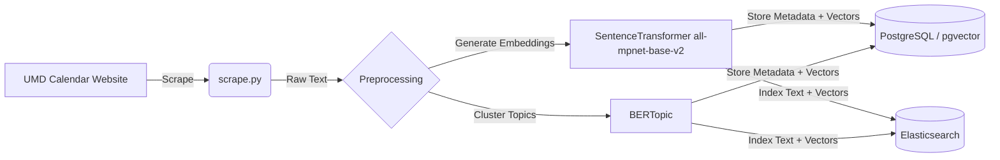

# UMD Events Dialogue System (Testudo Bot)

**Team:** Group-7 (Chanakya Chelamkuri, Manoj Kumar Bashaboina, Vineet Jujjavarapu, Venkata Siva Rajesh Vithanala)

**Course:** DATA641 Natural Language Processing, University of Maryland

## 📖 Overview

Testudo Bot is a conversational question-answering system designed to help users discover University of Maryland (UMD) events using natural language. It solves the problem of information overload in traditional calendar interfaces by integrating **Retrieval-Augmented Generation (RAG)** with **unsupervised topic modeling**.

The system scrapes the official UMD events calendar, indexes events using hybrid retrieval (vector + keyword), and generates grounded responses using a Large Language Model (LLM) to minimize hallucinations.

## ✨ Key Features

- **Hybrid Retrieval:** Combines **Elasticsearch** keyword search (BM25) with **dense vector search** (all-mpnet-base-v2 embeddings) to capture both exact matches and semantic intent.

- **Grounded RAG:** Generates answers strictly from retrieved event contexts. The system is time-aware, allowing it to interpret relative queries like "events this weekend" or "career fairs tomorrow".

- **Topic Modeling:** Uses **BERTopic** to cluster events into semantic categories (e.g., "Music", "Career") and auto-generates topic labels for UI filtering.

- **Conversational Interface:** Built with **Chainlit**, supporting interactive chat, rich source citations (cards with date/location), and topic selection.

- **Evaluation:** Integrated **RAGAS** metrics (faithfulness, answer relevancy, context precision) to quantitatively assess performance.

## 🏗️ System Architecture

The project follows a microservices architecture orchestrated via Docker Compose:

1. **Data Ingestion (`scrape.py`)**: Scrapes event data (title, date, time, location, description) from `calendar.umd.edu`.
2. **Storage Layer**:
   - **PostgreSQL (`pgvector`)**: Stores structured event metadata and high-dimensional vector embeddings.

   - **Elasticsearch**: Indexes text and vectors for high-performance hybrid search.

3. **Application Logic (`app.py`)**:
   - Connects to the LLM provider via **Groq** (supporting low-latency Llama 3.x models).
   - Handles query processing, retrieval ranking, and response generation.

4. **Loader Service (`loader.py`)**: An initialization service that automatically populates the databases from the scraped JSON data upon startup.

### High-Level Design


_Figure 1: Data Pipeline - From scraping the UMD calendar to generating embeddings and storing in Postgres/Elasticsearch._



### Query Workflow


_Figure 2: RAG Inference Flow - How the system processes user queries using hybrid retrieval and topic filtering before generating an LLM response._


## 🚀 Replication Instructions

Follow these steps to replicate and run the system locally.

### Prerequisites

- **Docker** and **Docker Compose** installed on your machine.
- **Git** for cloning the repository.
- An API key from **Groq** (for LLM access).

### Step 1: Clone the Repository

```bash
git clone https://github.com/vineetj5/UMD_Event_DialogSystem.git
cd UMD_Event_DialogSystem

```

### Step 2: Configure Environment Variables

Create a `.env` file in the root directory. You must add your Groq API key (from https://console.groq.com).

```bash
# .env file
GROQ_API_KEY=your_actual_api_key_here

# Optional: Override defaults if needed
DB_NAME=umd_events
DB_USER=umd_user
DB_PASSWORD=umd_password
ELASTIC_HOST=http://elasticsearch:9200

```

### Step 3: Build and Run with Docker

The `docker-compose.yaml` file defines the services for the database, search engine, data loader, and application.

```bash
docker compose up --build

```

**What happens during startup:**

1. **`db` (Postgres)** and **`elasticsearch`** containers start first.
2. **`loader`** service waits for the database to be healthy, then reads the event data from `umd_calendar_2025-10-01_to_2025-10-31.json` and indexes it into both Postgres and Elasticsearch.
3. **`app`** service starts the Chainlit server once data loading is complete.

### Step 4: Access the Application

Once the containers are running, open your browser and navigate to:

```
http://localhost:8501

```

To stop the application, run:

```bash
docker compose down

```

## 📂 Project Structure

| File                  | Description                                                                             |
| --------------------- | --------------------------------------------------------------------------------------- |
| `app.py`              | Main application entry point. Handles Chainlit UI, RAG logic, and LLM interaction.      |
| `loader.py`           | Utility script to load JSON event data into PostgreSQL and Elasticsearch.               |
| `scrape.py`           | Scraper script to fetch new event data from the UMD calendar website.                   |
| `docker-compose.yaml` | Orchestrates the multi-container setup (App, DB, Elastic, Loader).                      |
| `Dockerfile`          | Defines the Python environment for the app and loader services.                         |
| `requirements.txt`    | Lists Python dependencies (e.g., `chainlit`, `sentence-transformers`, `elasticsearch`). |
| `*.json`              | Scraped event data used for seeding the database.                                       |

## 🧪 Evaluation

The system includes a `/test` command within the chat interface to run evaluation metrics using the **RAGAS** framework. This calculates:

- **Context Precision:** 1.0000 (Perfect retrieval of relevant chunks).

- **Faithfulness:** 1.0000 (No hallucinations in generated answers).

- **Answer Relevancy:** 0.6618 (Relevance of the answer to the query).

- **Recall:** 0.662

## 🛠 Troubleshooting

- **Database Connection Errors:** Ensure the `db` service is "healthy" before the app tries to connect. The `docker-compose.yaml` includes a health check for this purpose.
- **Missing API Key:** If the chat does not respond, verify that `GROQ_API_KEY` is set correctly in your `.env` file.
- **Dependencies:** If running locally without Docker, ensure you install the "Missing Dependencies Fix" listed in `requirements.txt` (specifically `python-dateutil` and `pytz`).
